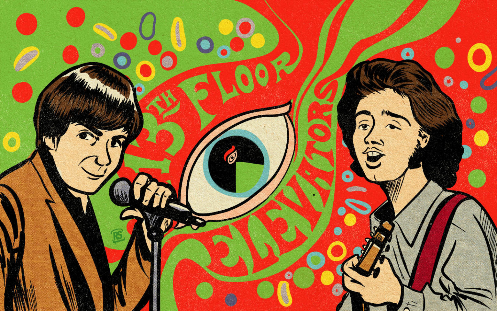
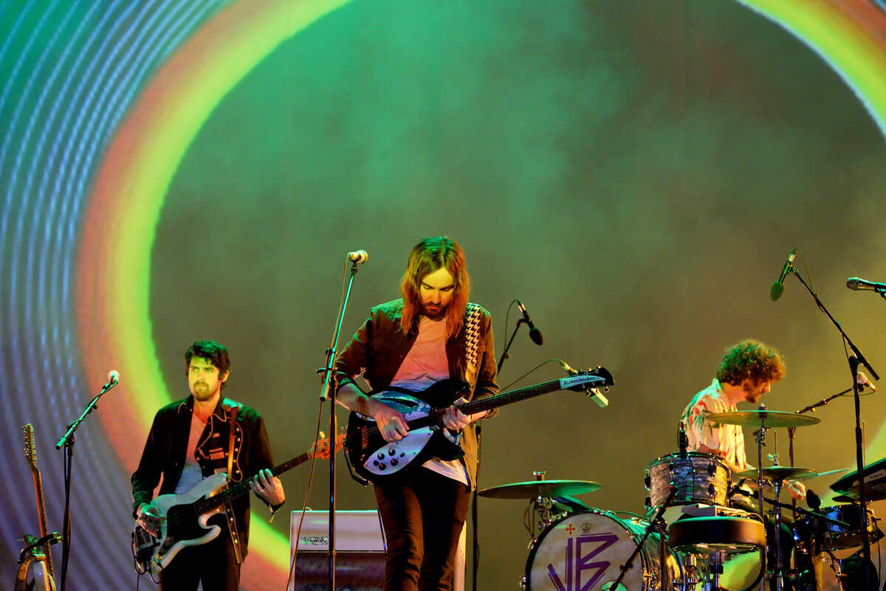
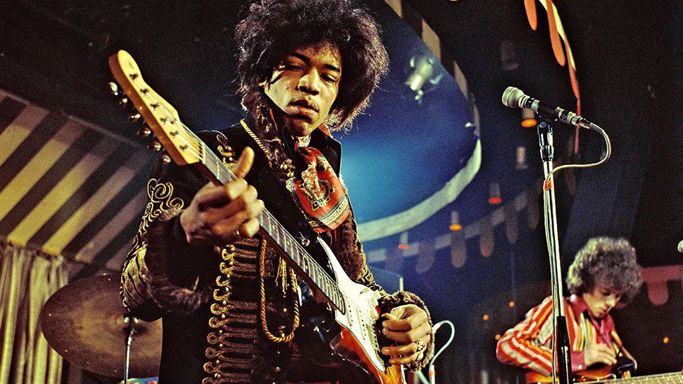

<style>
body {
  background:  rgb(130, 92, 128, 0.2);
}
.navbar-inverse {                /* navbar */
    background-color:  rgb(130, 92, 128, 0.7);
    border-color: white;
}
.navbar-inverse .navbar-nav>.active > a, .navbar-inverse .navbar-nav>.active > a:hover, .navbar-inverse .navbar-nav>.active > a:focus {
  color: #ffffff;
  background-color: rgb(209, 72, 67, 0.45);     /* active tab */
}
.navbar-inverse .navbar-nav>li > a:hover, .navbar-inverse .navbar-nav > li > a:focus {
  color: #ffffff;
  background-color: rgb(209, 72, 67, 0.45);    /* inactive tab on hover/focus */
}
.sidebar.section.sidebar {    /* sidebar */
  background-color: #ffffff;
}
.nav-tabs-custom > .nav-tabs > li.active {    /* tabset border color */
  border-top-color: rgb(209, 72, 67, 0.45);
}
/* navbar (dropdown) color */
.navbar-inverse .dropdown-menu > li > a:hover, .navbar-inverse .dropdown-menu > li > a:focus {
  background-color: rgb(209, 72, 67, 0.45);
  color: #ffffff;
}
/* navbar (dropdown) color */
.navbar-inverse .dropdown-menu > .active > a, .navbar-inverse .dropdown-menu > .active > a:hover, .navbar-inverse .dropdown-menu > .active > a:focus {
  background-color: rgb(209, 72, 67, 0.45);
  color: #ffffff;
}
/* navbar (dropdown) color */
.navbar-inverse .navbar-nav>.open>a, .navbar-inverse .navbar-nav>.open>a:hover, .navbar-inverse .navbar-nav>.open>a:focus {
  background-color: rgb(209, 72, 67, 0.45);
  color: #ffffff;
}
</style>

```{r setup, include=FALSE}
knitr::opts_chunk$set(echo = TRUE)
library(ggplot2)
library(flexdashboard)
library(tidyverse)
library(spotifyr)
library(compmus)
library(plotly)
library(ggdendro)
library(heatmaply)
library(tidymodels)

tameImpala <- get_artist_audio_features('tame impala')
jimiHendrix <- get_artist_audio_features('jimi hendrix')

currents <- c('2X485T9Z5Ly0xyaghN73ed','1cCbsojaA6GIT7Y3zuMJ1q', '1UYj8qTWjneZJDVjUMwMub', '0xtIp0lgccN85GfGOekS5L', '5M4yti0QxgqJieUYaEXcpw', '79chzfFIIq7cHkqcYYORk0', '6K4t31amVTZDgR3sKmwUJJ', '4a9fW33mYR8LhXBOLUhbfF', '2gNfxysfBRfl9Lvi9T3v6R', '2O99aywAVBhaPrsiJ6zbSS', '3I7OmVsk4Hm5LBbs2GmhlD', '5h9hkYIBWTZYFRmF6Iz1gt', '52ojopYMUzeNcudsoz7O9D')
currentsFeatures <- get_track_audio_features(currents)

elecLadyland <- c('4COmeKH1pLNNpXcgtMcyQH', '3Yh64aiu2ANBwDFztyPDkT', '1ntxpzIUbSsizvuAy6lTYY', '0auKlivXpm76wR63mMJ3pR', '1jhH7vvy8hoHuc0mGuZsLX', '1HFj7yC7uZfqjWuoH6DO9r', '0KqHJXm4Z42fELkW83ZW0r', '1DfWmv1eJU1a9tuGpqKGFP', '36SULeBeglappJysOY6WzQ', '0xwG5stzrc5B70TycPwenY', '5uDpwSGjljhIgDB1ZYdp9c', '3q3gK9I4mj03565IGtVA0d', '0xKcrFF5ed7U4EPdG6vE4f', '6p5RohbRLDSjeERMZ90hMg', '2aoo2jlRnM3A0NyLQqMN2f', '2AxCeJ6PSsBYiTckM0HLY7')
elecLadylandFeatures <- get_track_audio_features(elecLadyland)

tlikID <- '6K4t31amVTZDgR3sKmwUJJ'
bomlID <- '36SULeBeglappJysOY6WzQ'

circshift <- function(v, n) {
  if (n == 0) v else c(tail(v, n), head(v, -n))
}

#      C     C#    D     Eb    E     F     F#    G     Ab    A     Bb    B
major_chord <-
  c(   1,    0,    0,    0,    1,    0,    0,    1,    0,    0,    0,    0)
minor_chord <-
  c(   1,    0,    0,    1,    0,    0,    0,    1,    0,    0,    0,    0)
seventh_chord <-
  c(   1,    0,    0,    0,    1,    0,    0,    1,    0,    0,    1,    0)

major_key <-
  c(6.35, 2.23, 3.48, 2.33, 4.38, 4.09, 2.52, 5.19, 2.39, 3.66, 2.29, 2.88)
minor_key <-
  c(6.33, 2.68, 3.52, 5.38, 2.60, 3.53, 2.54, 4.75, 3.98, 2.69, 3.34, 3.17)

chord_templates <-
  tribble(
    ~name, ~template,
    "Gb:7", circshift(seventh_chord, 6),
    "Gb:maj", circshift(major_chord, 6),
    "Bb:min", circshift(minor_chord, 10),
    "Db:maj", circshift(major_chord, 1),
    "F:min", circshift(minor_chord, 5),
    "Ab:7", circshift(seventh_chord, 8),
    "Ab:maj", circshift(major_chord, 8),
    "C:min", circshift(minor_chord, 0),
    "Eb:7", circshift(seventh_chord, 3),
    "Eb:maj", circshift(major_chord, 3),
    "G:min", circshift(minor_chord, 7),
    "Bb:7", circshift(seventh_chord, 10),
    "Bb:maj", circshift(major_chord, 10),
    "D:min", circshift(minor_chord, 2),
    "F:7", circshift(seventh_chord, 5),
    "F:maj", circshift(major_chord, 5),
    "A:min", circshift(minor_chord, 9),
    "C:7", circshift(seventh_chord, 0),
    "C:maj", circshift(major_chord, 0),
    "E:min", circshift(minor_chord, 4),
    "G:7", circshift(seventh_chord, 7),
    "G:maj", circshift(major_chord, 7),
    "B:min", circshift(minor_chord, 11),
    "D:7", circshift(seventh_chord, 2),
    "D:maj", circshift(major_chord, 2),
    "F#:min", circshift(minor_chord, 6),
    "A:7", circshift(seventh_chord, 9),
    "A:maj", circshift(major_chord, 9),
    "C#:min", circshift(minor_chord, 1),
    "E:7", circshift(seventh_chord, 4),
    "E:maj", circshift(major_chord, 4),
    "G#:min", circshift(minor_chord, 8),
    "B:7", circshift(seventh_chord, 11),
    "B:maj", circshift(major_chord, 11),
    "D#:min", circshift(minor_chord, 3)
  )

key_templates <-
  tribble(
    ~name, ~template,
    "Gb:maj", circshift(major_key, 6),
    "Bb:min", circshift(minor_key, 10),
    "Db:maj", circshift(major_key, 1),
    "F:min", circshift(minor_key, 5),
    "Ab:maj", circshift(major_key, 8),
    "C:min", circshift(minor_key, 0),
    "Eb:maj", circshift(major_key, 3),
    "G:min", circshift(minor_key, 7),
    "Bb:maj", circshift(major_key, 10),
    "D:min", circshift(minor_key, 2),
    "F:maj", circshift(major_key, 5),
    "A:min", circshift(minor_key, 9),
    "C:maj", circshift(major_key, 0),
    "E:min", circshift(minor_key, 4),
    "G:maj", circshift(major_key, 7),
    "B:min", circshift(minor_key, 11),
    "D:maj", circshift(major_key, 2),
    "F#:min", circshift(minor_key, 6),
    "A:maj", circshift(major_key, 9),
    "C#:min", circshift(minor_key, 1),
    "E:maj", circshift(major_key, 4),
    "G#:min", circshift(minor_key, 8),
    "B:maj", circshift(major_key, 11),
    "D#:min", circshift(minor_key, 3)
  )

get_conf_mat <- function(fit) {
  outcome <- .get_tune_outcome_names(fit)
  fit |> 
    collect_predictions() |> 
    conf_mat(truth = outcome, estimate = .pred_class)
}  

get_pr <- function(fit) {
  fit |> 
    conf_mat_resampled() |> 
    group_by(Prediction) |> mutate(precision = Freq / sum(Freq)) |> 
    group_by(Truth) |> mutate(recall = Freq / sum(Freq)) |> 
    ungroup() |> filter(Prediction == Truth) |> 
    select(class = Prediction, precision, recall)
} 

```

Introduction
=====================================  

Column {.sidebar data-width=400}
-----------------------------------------------------------------------

### The Secrets Behind Psychedelic Rock

Psychedelic rock emerged as a style of rock music in early 1960s. As you may have guessed from its name, the inspiration for this genre mainly came from hallucinogens that can "expand your mind" and guide you into an otherworldly trip (think LSD or magic mushrooms). It uses intense electronic sound effects and extended instrumental solos to imitate the drug-induced state that psychedelic users go through. 

For this project, I will be mainly focusing on the secrets in the evolution of psychedelic rock from when it was born to today -- what techniques were used differently and how did that change what the songs want to convey? Specifically, I will be focusing on two bands that represent an era in psychedelic rock: Jimi Hendrix (who is almost synonymous with psychedelic rock when it was born) and Tame Impala (widely regarded as one of the most successful modern psychedelic rock bands).

To the right is a brief background of both bands as well as their playlists -- feel free to take a look and get familiar with their music! 

<!-- ```{r, fig.width=5, fig.height=5} -->
<!--  -->
<!-- ``` -->

<!-- {width=50%} -->


Column {.tabset}
-----------------------------------------------------------------------

### Background

#### Tame Impala

{width=100%}

Tame Impala is a musical project primarily consisting of Kevin Parker, a multi-instrumentalist and producer from Perth, Australia. The music of Tame Impala is known for its psychedelic and dreamy soundscapes, with Parker often experimenting with various production techniques to create a unique and otherworldly atmosphere. The music draws inspiration from a range of genres, including psychedelic rock, funk, and electronic music, and often features intricate instrumentation and rich harmonies. I will be examining his top album *Currents* and his top hit "The Less I Know The Better" in the rest of this corpus. 

### Playlist

<iframe src="https://open.spotify.com/embed/album/79dL7FLiJFOO0EoehUHQBv?utm_source=generator" height="100%" width="100%" style="border: none" allowfullscreen="" allow="autoplay" data-external="1"></iframe>

Column {.tabset}
-----------------------------------------------------------------------

### Background

#### Jimi Hendrix

Jimi Hendrix was an American musician, singer, and songwriter who is widely regarded as one of the most influential and innovative guitarists in the history of rock music. His style of playing was characterized by his innovative use of distortion, feedback, and wah-wah effects, which he used to create a unique sound that was both melodic and psychedelic. He was also known for his flamboyant stage presence and his use of showmanship, which helped to make him a popular figure in the counterculture of the 1960s. As a result, he became a leading figure in this movement of psychedelic rock, and his music was heavily influenced by his experiences with LSD and other psychedelic drugs. I will be examining his top album *Electric Ladyland* and his top hit "The Burning of the Midnight Lamp" in the rest of this corpus. \n \n \n

{width=100%}

### Playlist

<iframe src="https://open.spotify.com/embed/album/5z090LQztiqh13wYspQvKQ?utm_source=generator" height="100%" width="100%" style="border: none;" allowfullscreen="" allow="autoplay" data-external="1"></iframe>


Tempo vs. Energy {data-navmenu=Track-Level\ Analysis}
=====================================================================

Column {.tabset data-width=30%}
-------------------------------------------------

### Tame Impala: Graph

<!-- #### bpm -->
<!-- ```{r echo=FALSE, fig.width=30} -->
<!-- library(flexdashboard) -->
<!-- gauge(42, min = 0, max = 100, symbol = 'bpm', gaugeSectors( -->
<!--   success = c(80, 100), warning = c(40, 79), danger = c(0, 39) -->
<!-- )) -->
<!-- ``` -->

<!-- #### energy -->
<!-- ```{r echo=FALSE } -->
<!-- library(flexdashboard) -->
<!-- gauge(0.7, min = 0, max = 1.0, symbol = 'energy', gaugeSectors( -->
<!--   success = c(0.80, 1.00), warning = c(0.40, 0.79), danger = c(0, 0.39) -->
<!-- )) -->
<!-- ``` -->

<!-- # ```{r tameimpala1, echo=FALSE} -->
<!-- # library(ggplot2) -->
<!-- # library(tidyverse) -->
<!-- # library(spotifyr) -->
<!-- # library(compmus) -->
<!-- # -->
<!-- # tameImpala <- get_artist_audio_features('tame impala') -->
<!-- # ggplot(tameImpala, aes(x = tempo, y = energy, size = valence, color = album_name)) + geom_point() + ggtitle("Tame Impala Analysis") -->
<!-- # -->
<!-- # ``` -->

```{r tameimpala1, echo=FALSE}
p <- ggplot(currentsFeatures, aes(x = tempo, y = energy, size = valence, color = mode)) + geom_point() + ggtitle("Currents")
ggplotly(p)
currentsMeanTempo <- currentsFeatures %>% summarize(meanTempo = mean(tempo), meanEnergy = mean(energy))
```

### Tame Impala: Analysis

Tame Impala's album, Currents, generally follows a pretty fast BPM that falls between 100 - 150, with a median of 125.01 BPM. Almost all thirteen songs but three fall within this range. It also has a very high energy level -- eleven songs have an energy level that is greater than 0.6, with the album median at about 0.74 From this, we can infer that the album is very energetic and feels loud and fast. In addition to that, the majority of the songs use major scales (indicated by blue circles that represent a major as a 1 in the plot).

It's interesting to note that the valence levels of this album is very neutral. Its median is at 0.45, meaning that its musical positiveness is not at either extreme. It is very neutral despite its high energy levels and its use of major scales, which are typically associated with creating a happy or uplifting mood. 

Column {.tabset data-width=30%}
-------------------------------------------------

### Jimi Henrix: Graph

```{r jimiHendrix1, echo=FALSE}
p <- ggplot(elecLadylandFeatures, aes(x = tempo, y = energy, size = valence, color = mode)) + geom_point() + ggtitle("Electric Ladyland")
ggplotly(p)
```

### Jimi Hendrix: Analysis

In Jimi Hendrix's album, Electric Ladyland, it is important to note that the track "Moon, Turn the Tides... Gently Gently Away" lies outside the general range of all values of other songs. This is because it is an interlude song within the album, and its purpose was to connect the tracks "1983... (A Merman I Should Turn to Be)" and "Still Raining, Still Dreaming".

Electric Ladyland also follows a typically fast BPM, but it is more moderato than allegro. It's median is at 113.19 BPM, which falls into the moderate range of beats in music. It also has a median valence value of 0.54 and median energy level of 0.81, indicating that it is a relatively loud and fast album despite also being neutral in terms of musical positivity. It also uses major scales for most of its songs. 

Column {.tabset data-width=30%}
-------------------------------------------------

#### Compare

The two scatterplots shown on the left represent the relationship between each album's tempo, energy, valence, and mode. I wanted to focus on these factors first because to me, pschydelic music is heavily involved with beats and the energy/mood that it brings to its audience. You can click through the tabs to view each album's individual analysis first, then come back for the compare and contrast.

In general, the two albums are actually very similar in the four factors involved. They both had very similar median values for tempo, valence, and energy, and both used mainly major scales. Electric Ladyland had a slightly slower tempo (a difference of 11.92 BPM between the medians), but it also has a slightly higher energy and valence level (a difference of 0.09 in valence and 0.07 in energy). 

This was interesting to me because I had thought that a faster tempo is often correlated with more energy, as fast music often brings people to dance and closer to experiencing positivity. However, when examining these two albums, it seems like Currents had a quicker tempo but remained relatively neutral in inducing emotions in its audience, while The Burning of the Midnight Lamp had a slower tempo but was able to bring out more in its listeners. 

Key Histograms {data-orientation=rows data-navmenu=Track-Level\ Analysis}
===================================================

Row {data-height=75}
-------------------------------------------------

### Background

Musical keys have always been associated with emotional or qualitative characteristics. One of the most widely spread descriptions of such characteristics was produced by Christian Schubart in his work *Ideen zu einer Aesthetik der Tonkunst* in 1806. I wanted to see what keys did Tame Impala and Jimi Hendrix use: was there a key that they used very often? If so, what did they want to convey through that? I will be evaluating using [Shubart's work](https://wmich.edu/mus-theo/courses/keys.html).

Row {data-height=250}
-------------------------------------------------

### Tame Impala {data-width=500}

Tame Impala favored using the C major key throughout his entire discography, with D# (Eb) major and G major coming in second and third. The C major is known to resemble a character's innocence and freedom from burden; the D# major is related to love and conversation with God; and, the G major represents gentleness and peacefulness. It seems like Tame Impala's music triggers the audience's desire to stay pure and gentle, and their overwhelming use of the C major taps into their listeners' inner-selves. This also correlates with the genre of psychedelic rock because the use of psychedelics is linked to an increasing sense of the mind and opens up the user to themselves.

### Tame Impala: Histogram

```{r tameImpala2, echo=FALSE, fig.width=6, fig.height=2}
ggplot(tameImpala, aes(x=key, fill=factor(mode))) + geom_bar() + scale_x_discrete(name = "key", labels=c("C", "C#", "D", "D#", "E", "F", "F#", "G", "G#", "A", "A#", "B"), limits= c(0,1,2,3,4,5,6,7,8,9,10,11)) + scale_fill_discrete(name="mode", labels=c("minor","major"))
```

Row {data-height=250}
-------------------------------------------------

### Jimi Hendrix {data-width=500}

Jimi Hendrix uses two main keys throughout his entire discography: the C# (Db) major and the G# (Ab) major. The C# major represents grief and sadness, and it brings out unusual characters and feelings. Similarly, the G# major is associated with death and grave. What's interesting is that these two keys are not commonly used in popular music; however, it is very clear that Hendrix still favors these two keys over the others as there is a clear distinction between the frequency of C# and G# and the remaining keys. These characteristics contribute to the genre of psychedelic rock because the combination of the use of two unusual keys, as well as the negative feelings that they introduce to the audience, was able to contribute to a tonal ambiguity. As a result, Hendrix was able to produce a dreamlike quality in his music that is characteristic of the psychedelic genre.

### Jimi Hendrix: Histogram

```{r jimiHendrix2, echo=FALSE, fig.width=6, fig.height=2}
ggplot(jimiHendrix, aes(x=key, fill=factor(mode))) + geom_bar() + scale_x_discrete(name = "key" , labels=c("C", "C#", "D", "D#", "E", "F", "F#", "G", "G#", "A", "A#", "B"), limits= c(0,1,2,3,4,5,6,7,8,9,10,11)) + scale_fill_discrete(name="mode", labels=c("minor","major"))
```

Chromagrams {data-navmenu=Top\ Hit\ Analysis}
==============================================================================

Column {.tabset}
---------------------------------------------

### "The Less I Know The Better"

``` {r tameImpala3, echo=FALSE}
tlik <-
  get_tidy_audio_analysis(tlikID) |>
  select(segments) |>
  unnest(segments) |>
  select(start, duration, pitches)

tlik |>
  mutate(pitches = map(pitches, compmus_normalise, "euclidean")) |>
  compmus_gather_chroma() |>
  ggplot(
    aes(
      x = start + duration / 2,
      width = duration,
      y = pitch_class,
      fill = value
    )
  ) +
  geom_tile() +
  labs(x = "Time (s)", y = NULL, fill = "Magnitude") +
  theme_minimal() +
  scale_fill_viridis_c()
```

### "The Burning of the Midnight Lamp"

``` {r jimiHendrix3, echo=FALSE}
boml <-
  get_tidy_audio_analysis(bomlID) |>
  select(segments) |>
  unnest(segments) |>
  select(start, duration, pitches)

boml |>
  mutate(pitches = map(pitches, compmus_normalise, "euclidean")) |>
  compmus_gather_chroma() |>
  ggplot(
    aes(
      x = start + duration / 2,
      width = duration,
      y = pitch_class,
      fill = value
    )
  ) +
  geom_tile() +
  labs(x = "Time (s)", y = NULL, fill = "Magnitude") +
  theme_minimal() +
  scale_fill_viridis_c()
```

Column
--------------------------------------------------------

### "The Less I Know The Better" Analysis

The chromagram for Tame Impala's top hit, "The Less I Know The Better", is computed using the Euclidean distance, which allows it to capture the similarities between two chroma vectors. It is particularly interesting because there is evidence for a wide range of pitch distribution as well as the consistent use of certain chords throughout the entire song. For example, pitches E and C# are repeatedly used in alternating intervals, with each segment lasting about 5 seconds. Pitches B and D# also occur in the same way, but with each segment lasting about 2 seconds. These alternating sequences of pitches indicate the complex makeup of "The Less I Know The better", as the song is composed of several layers of sounds: the repetition of bassline, the use of dreamy guitar, as well as the variations of synth parts. 

### "The Buring of the Midnight Lamp" Analysis

The chromagram for Jimi Hendrix's top hit, "The Burning of the Midnight Lamp", is also computed with Euclidean distance. Compare to "The Less I Know The Better", this chromagram displays much less variation across the use of pitches. Jimi Hendrix mostly focused on pitches F, E, D, and C; the overlap of segments of these pitches suggest that he tried to focus on harmony rather than alternating sequences of instruments. This is also supported by instances where magnitudes of these pitches spike together. For example, around 70sec and 150sec, pitches F and C both show a high magnitude that last about 5-7 seconds. They also correspond to the beginning of the two intense guitar solos during the song, showing how much Hendrix places emphasis on creating harmonies between the drums and the guitar. 

Self-Similarity Matrices {data-navmenu=Top\ Hit\ Analysis}
==============================================================================

Column {.tabset}
------------------------------------------------------------------------------

<!-- # tlik <- -->
<!-- #   get_tidy_audio_analysis(tlikID) |> # Change URI. -->
<!-- #   compmus_align(beats, segments) |>                     # Change `bars` -->
<!-- #   select(beats) |>                                      #   in all three -->
<!-- #   unnest(beats) |>                                      #   of these lines. -->
<!-- #   mutate( -->
<!-- #     pitches = -->
<!-- #       map(segments, -->
<!-- #         compmus_summarise, pitches, -->
<!-- #         method = "rms", norm = "chebyshev"              # Change summary & norm. -->
<!-- #       ) -->
<!-- #   ) |> -->
<!-- #   mutate( -->
<!-- #     timbre = -->
<!-- #       map(segments, -->
<!-- #         compmus_summarise, timbre, -->
<!-- #         method = "rms", norm = "chebyshev"              # Change summary & norm. -->
<!-- #       ) -->
<!-- #   ) -->
<!-- #  -->
<!-- # tlik |> -->
<!-- #   compmus_gather_timbre() |> -->
<!-- #   ggplot( -->
<!-- #     aes( -->
<!-- #       x = start + duration / 2, -->
<!-- #       width = duration, -->
<!-- #       y = basis, -->
<!-- #       fill = value -->
<!-- #     ) -->
<!-- #   ) + -->
<!-- #   geom_tile() + -->
<!-- #   labs(x = "Time (s)", y = NULL, fill = "Magnitude") + -->
<!-- #   scale_fill_viridis_c() + -->
<!-- #   theme_classic() -->

### "The Less I Know The Better"

``` {r tameImpala4, echo=FALSE}
tlik <-
  get_tidy_audio_analysis(tlikID) |>
  compmus_align(bars, segments) |>
  select(bars) |>
  unnest(bars) |>
  mutate(
    pitches =
      map(segments,
        compmus_summarise, pitches,
        method = "acentre", norm = "manhattan"
      )
  ) |>
  mutate(
    timbre =
      map(segments,
        compmus_summarise, timbre,
        method = "mean"
      )
  )
bind_rows(
  tlik |> 
    compmus_self_similarity(pitches, "aitchison") |> 
    mutate(d = d / max(d), type = "Chroma"),
  tlik |> 
    compmus_self_similarity(timbre, "euclidean") |> 
    mutate(d = d / max(d), type = "Timbre")
) |>
  mutate() |> 
  ggplot(
    aes(
      x = xstart + xduration / 2,
      width = xduration,
      y = ystart + yduration / 2,
      height = yduration,
      fill = d
    )
  ) +
  geom_tile() +
  coord_fixed() +
  facet_wrap(~type) +
  scale_fill_viridis_c(option = "E", guide = "none") +
  theme_classic() + 
  labs(x = "", y = "")
```

### "The Burning of the Midnight Lamp"

<!-- boml <- -->
<!--   get_tidy_audio_analysis(bomlID) |> # Change URI. -->
<!--   compmus_align(beats, segments) |>                     # Change `bars` -->
<!--   select(beats) |>                                      #   in all three -->
<!--   unnest(beats) |>                                      #   of these lines. -->
<!--   mutate( -->
<!--     pitches = -->
<!--       map(segments, -->
<!--         compmus_summarise, pitches, -->
<!--         method = "rms", norm = "chebyshev"              # Change summary & norm. -->
<!--       ) -->
<!--   ) |> -->
<!--   mutate( -->
<!--     timbre = -->
<!--       map(segments, -->
<!--         compmus_summarise, timbre, -->
<!--         method = "rms", norm = "chebyshev"              # Change summary & norm. -->
<!--       ) -->
<!--   ) -->

<!-- boml |> -->
<!--   compmus_gather_timbre() |> -->
<!--   ggplot( -->
<!--     aes( -->
<!--       x = start + duration / 2, -->
<!--       width = duration, -->
<!--       y = basis, -->
<!--       fill = value -->
<!--     ) -->

<!--   ) + -->
<!--   geom_tile() + -->
<!--   labs(x = "Time (s)", y = NULL, fill = "Magnitude") + -->
<!--   scale_fill_viridis_c() + -->
<!--   theme_classic() -->

``` {r jimiHendrix4, echo=FALSE}

boml <-
  get_tidy_audio_analysis(bomlID) |>
  compmus_align(bars, segments) |>
  select(bars) |>
  unnest(bars) |>
  mutate(
    pitches =
      map(segments,
        compmus_summarise, pitches,
        method = "acentre", norm = "manhattan"
      )
  ) |>
  mutate(
    timbre =
      map(segments,
        compmus_summarise, timbre,
        method = "mean"
      )
  )
bind_rows(
  boml |> 
    compmus_self_similarity(pitches, "aitchison") |> 
    mutate(d = d / max(d), type = "Chroma"),
  boml |> 
    compmus_self_similarity(timbre, "euclidean") |> 
    mutate(d = d / max(d), type = "Timbre")
) |>
  mutate() |> 
  ggplot(
    aes(
      x = xstart + xduration / 2,
      width = xduration,
      y = ystart + yduration / 2,
      height = yduration,
      fill = d
    )
  ) +
  geom_tile() +
  coord_fixed() +
  facet_wrap(~type) +
  scale_fill_viridis_c(option = "E", guide = "none") +
  theme_classic() + 
  labs(x = "", y = "")

```

Column
------------------------------------------------------------------------------

### Background {data-height=100}

The two self-similarity matrices on the left are each summarized at the bar level and illustrate pitch- and timbre-based self-similarity within the top hits of the two artists. 

### "The Less I Know The Better" Analysis

In the chroma-based self-similarity matrix for "The Less I Know The Better', there are few clear parallel diagonal lines; instead, it mostly presents a checkerboard composed of small blocks. The checkerboard means that there are a lot of repeating notes or motifs that happen throughout the entire song, and its composition of small blocks means that these repetitive themes are fairly short and often change quickly and frequently, creating a complex harmonic texture. This corresponds to the chord sequence that "The Less I Know The Better" uses -- a four-note pattern that is frequently heard throughout the verse section of the song. It is composed of the chords Bm, E, G, and F#, and it resembles the signature guitar riff. Starting from around 70sec and 145sec, we can see the start of a new section of small blocks, and these represent the chorus parts of the song. They use a slightly different four-note pattern with chords Bm, F#, G, F#, hence creating a dividing line in the matrix.

In the timbre-based self-similarity matrix, we can see a few yellow lines that cross throughout the entire song, which resemble a sudden change in timbre. One of the most notable ones happens during the first 10 seconds, and this actually represents the guitar solo at the beginning of the song that is not seen anywhere else in the rest of the song. There are also yellow lines throughout the matrix that divide the verse sections from the chorus sections, such as at 70sec and 100sec, and these indicate short periods of time where vocals disappear and pure instruments make up the bridge between the two sections. 

### "The Burning of the Midnight Lamp" Analysis

In the chroma-based self-similarity matrix for "The Burning of the Midnight Lamp", there are a few sections with clear parallel diagonal lines that represent repeating motives. For example, the section from 30sec to 60sec is repeated again from 70sec to 100sec and 150sec to 180sec. This indicates the verse sections which are repeated 3 times throughout the entire song. The bright lines that separate these sections that last from 60sec to 70sec and 145sec to 155sec represent the bridge with no vocals; however, these bridges are different every time and are therefore not homogeneous.

In the timbre-based self-similarity matrix, there is obvious yellow line that occurs at 60sec to 65sec that is not seen anywhere else in the rest of the graph. This significant change in timbre is the bridge between the first chorus and the second bridge, where there are only vocals and no instruments. This is not repeated anywhere throughout the rest of the song; hence, the yellow line is very prominent. The second, fainter yellow line occurs after the second chorus around 110sec. This is the bridge that allows Hendrix to transition from traditional rock to more psychedelic guitar riffs that produce more distorted sounds. It is composed of a very short period of no instruments and is then followed by an intense arrangements of instruments. This contributes to building up the tension and energy for the last sections of the song. 

Chordograms {data-navmenu=Top\ Hit\ Analysis}
===================================================

Column
---------------------------------------------------

### "The Less I know The Better" Analysis

The chordogram generated to the right is based off of individual sections in "The Less I Know The Better", and it is interesting to see the differences in chords used for every part of the song. The song starts off with a repeated guitar riff, using chords such as F, G, and Eb. It then transitions to the verse sections, where the use of G minor, F, Bb major and D minor became more prominent. This also contributes to a more melancholy section, where the song is more introspective. At 70sec, the song transitions to the chorus section, where we see a drastic change in the chords used. Eb major is still used, but the distribution of chords used becomes more even, creating a sense of harmony. This pattern of verse section and chorus section repeats again, before the song ends with an outro that uses chords similar to the verse section. 

### "The Burning of the Midnight Lamp" Analysis

The chordogram to the right is also based off of individual sections in "The Burning of the Midnight Lamp", and it features a complex and diverse set of chord progressions that help to create the signature psychedelic and otherworldly sound. It opens with a signature guitar riff that uses chords D# minor, F# minor, and Gb major, thus creating a dreamy and mysterious atmosphere. As it transitions into the verse section at 25sec, the chord distributions even out, before following by the chorus section which focuses on A major and A minor to create a catchy and upbeat chord progression. This pattern continues until 140sec, where D# minor, B major, and G# minor come into play again to support the guitar riff. Overall, "The Burning of the Midnight Lamp" features a wide range of chord progressions that help to create a sense of tension and release.

Column {.tabset}
---------------------------------------------------

### "The Less I Know The Better"

``` {r tameImpala5, echo=FALSE}

tlik <-
  get_tidy_audio_analysis(tlikID) |>
  compmus_align(sections, segments) |>
  select(sections) |>
  unnest(sections) |>
  mutate(
    pitches =
      map(segments,
        compmus_summarise, pitches,
        method = "mean", norm = "manhattan"
      )
  )

tlik |>
  compmus_match_pitch_template(
    chord_templates,         # Change to chord_templates if descired
    method = "manhattan",  # Try different distance metrics
    norm = "manhattan"     # Try different norms
  ) |>
  ggplot(
    aes(x = start + duration / 2, width = duration, y = name, fill = d)
  ) +
  geom_tile() +
  scale_fill_viridis_c(guide = "none") +
  theme_minimal() +
  labs(x = "Time (s)", y = "")

```

### "The Burning of the Midnight Lamp"

``` {r jimiHendrix5, echo=FALSE}

boml <-
  get_tidy_audio_analysis(bomlID) |>
  compmus_align(sections, segments) |>
  select(sections) |>
  unnest(sections) |>
  mutate(
    pitches =
      map(segments,
        compmus_summarise, pitches,
        method = "mean", norm = "manhattan"
      )
  )

boml |>
  compmus_match_pitch_template(
    chord_templates,         # Change to chord_templates if descired
    method = "manhattan",  # Try different distance metrics
    norm = "manhattan"     # Try different norms
  ) |>
  ggplot(
    aes(x = start + duration / 2, width = duration, y = name, fill = d)
  ) +
  geom_tile() +
  scale_fill_viridis_c(guide = "none") +
  theme_minimal() +
  labs(x = "Time (s)", y = "")

```

Tempograms {data-navmenu=Top\ Hit\ Analysis}
===================================================

Column 
-------------------------------------------------

<!-- ### "The Less I Know The Better": Tempo -->

<!-- ``` {r tameImpala5, echo=FALSE} -->
<!-- tlik <- -->
<!--   get_tidy_audio_analysis(tlikID) |> -->
<!--   select(segments) |> -->
<!--   unnest(segments) -->

<!-- tlikplot <- tlik |> -->
<!--   mutate(loudness_max_time = start + loudness_max_time) |> -->
<!--   arrange(loudness_max_time) |> -->
<!--   mutate(delta_loudness = loudness_max - lag(loudness_max)) |> -->
<!--   ggplot(aes(x = loudness_max_time, y = pmax(0, delta_loudness))) + -->
<!--   geom_line() + -->
<!--   xlim(0, 30) + -->
<!--   theme_minimal() + -->
<!--   labs(x = "Time (s)", y = "Novelty") -->

<!-- ggplotly(tlikplot) -->
<!-- ``` -->

<!-- ### "The Less I Know The Better": Pitches -->

<!-- ``` {r tameImpala6, echo=FALSE} -->
<!-- tlik <- -->
<!--   get_tidy_audio_analysis(tlikID) |> -->
<!--   select(segments) |> -->
<!--   unnest(segments) -->

<!-- tlikplot <- tlik |> -->
<!--   mutate(pitches = map(pitches, compmus_normalise, "clr")) |> -->
<!--   arrange(start) |> -->
<!--   mutate(pitches = map2(pitches, lag(pitches), `-`)) |> -->
<!--   slice(-1) |>  -->
<!--   compmus_gather_chroma() |>  -->
<!--   group_by(start, duration) |>  -->
<!--   summarise(novelty = sum(log1p(pmax(value, 0)))) |>  -->
<!--   ggplot(aes(x = start + duration / 2, y = novelty)) + -->
<!--   geom_line() + -->
<!--   xlim(0, 30) + -->
<!--   theme_minimal() + -->
<!--   labs(x = "Time (s)", y = "Novelty") -->

<!-- ggplotly(tlikplot) -->
<!-- ``` -->

### "The Less I Know The Better" {data-height=50%}

```{r tameImpala7, echo=FALSE}
tlik <- get_tidy_audio_analysis(tlikID)

tlik |>
  tempogram(window_size = 8, hop_size = 1, cyclic = TRUE) |>
  ggplot(aes(x = time, y = bpm, fill = power)) +
  geom_raster() +
  scale_fill_viridis_c(guide = "none") +
  labs(x = "Time (s)", y = "Tempo (BPM)") +
  theme_classic()
```

### "The Burning of the Midnight Lamp" {data-height=50%}

```{r jimiHendrix7, echo=FALSE}
boml <- get_tidy_audio_analysis(bomlID)

boml |>
  tempogram(window_size = 8, hop_size = 1, cyclic = TRUE) |>
  ggplot(aes(x = time, y = bpm, fill = power)) +
  geom_raster() +
  scale_fill_viridis_c(guide = "none") +
  labs(x = "Time (s)", y = "Tempo (BPM)") +
  theme_classic()
```

Column
--------------------------------------------------

<!-- ### "Burning of the Midnight Lamp": Tempo -->

<!-- ``` {r boml4, echo=FALSE} -->
<!-- boml <- -->
<!--   get_tidy_audio_analysis(bomlID) |> -->
<!--   select(segments) |> -->
<!--   unnest(segments) -->

<!-- bomlplot <- boml |> -->
<!--   mutate(loudness_max_time = start + loudness_max_time) |> -->
<!--   arrange(loudness_max_time) |> -->
<!--   mutate(delta_loudness = loudness_max - lag(loudness_max)) |> -->
<!--   ggplot(aes(x = loudness_max_time, y = pmax(0, delta_loudness))) + -->
<!--   geom_line() + -->
<!--   xlim(0, 30) + -->
<!--   theme_minimal() + -->
<!--   labs(x = "Time (s)", y = "Novelty") -->

<!-- ggplotly(bomlplot) -->
<!-- ``` -->

<!-- ### "Burning of the Midnight Lamp": Pitches -->

<!-- ``` {r boml5, echo=FALSE} -->
<!-- boml <- -->
<!--   get_tidy_audio_analysis(bomlID) |> -->
<!--   select(segments) |> -->
<!--   unnest(segments) -->

<!-- bomlplot <- boml |> -->
<!--   mutate(pitches = map(pitches, compmus_normalise, "clr")) |> -->
<!--   arrange(start) |> -->
<!--   mutate(pitches = map2(pitches, lag(pitches), `-`)) |> -->
<!--   slice(-1) |>  -->
<!--   compmus_gather_chroma() |>  -->
<!--   group_by(start, duration) |>  -->
<!--   summarise(novelty = sum(log1p(pmax(value, 0)))) |>  -->
<!--   ggplot(aes(x = start + duration / 2, y = novelty)) + -->
<!--   geom_line() + -->
<!--   xlim(0, 30) + -->
<!--   theme_minimal() + -->
<!--   labs(x = "Time (s)", y = "Novelty") -->

<!-- ggplotly(bomlplot) -->
<!-- ``` -->

### "The Less I Know The Better" Analysis

"The Less I Know The Better" has a steady and consistent tempo throughout the song, as the tempogram on the right has a relatively straight bright line throughout the entire song. Spotify estimates the tempo to be around 116-118 BPM, which is moderate to slightly fast. As it can be seen from the tempogram, it features a consistent beat with drums, bass, and various electronic and acoustic instruments adding layers to the rhythm. There are some slight variations in the rhythmic patterns throughout the song, such as at around 40sec, 100sec, and 150sec, where very faint vertical yellow lines can be seen. They indicate the short bridges that connect two verse sections and involve a slight variation in the use of instruments. For example, at 100sec, an extra drum beat is added. At 150sec, the drums and bass drop out briefly to create a break, then come back in a more intense rhythm. These sections are used to build up the tension in the song and to contribute to the creation of a groove; however, since their main purpose is not to change the tempo, "The Less I Know The Better" still maintains a relatively consisten tempo throughout the entire song. 

### "The Burning of the Midnight Lamp" Analysis

"The Burning of the Midnight Lamp" does not have a steady and consistent tempo, unlike "The Less I Know The Better". The tempograms depicts the general tempo to be within the range of 140 to 160 BPM; however, there are a lot of variations within the rhythmic pattern for every section. The song begins with a slow, steady drum beat for the first guitar riff, with the tempo at about 140 BPM. During the verse sections, however, the tempo speeds up and continues doing so as the guitar riff becomes more and more intense until it reaches about 155 BPM. Then, the bridge between two verse sections happen, dropping the tempo back to 140 BPM. This trend occurs two more times. However, the tempogram begins to show more and more scattered yellow areas as the song goes on, perhaps due to the increasingly complex composition of instruments that are added to build up the climax of the song. The last 20-30sec of the song is the most prominent guitar riff, and it is also where the tempogram shows a lot of variations in its activity. This is most likely due to Spotify listening to a variety of different instruments, hence creating a complex and diverse section of the tempo.


Clustering
===================================================

Column
---------------------------------------------------


Column
---------------------------------------------------

```{r tameImpala8, echo=FALSE}
ti <-
  get_playlist_audio_features("tameimpala", "37i9dQZF1DZ06evO3n0Aus") |>
  add_audio_analysis() |>
  mutate(
    segments = map2(segments, key, compmus_c_transpose),
    pitches =
      map(segments,
        compmus_summarise, pitches,
        method = "mean", norm = "manhattan"
      ),
    timbre =
      map(
        segments,
        compmus_summarise, timbre,
        method = "mean"
      )
  ) |>
  mutate(pitches = map(pitches, compmus_normalise, "clr")) |>
  mutate_at(vars(pitches, timbre), map, bind_rows) |>
  unnest(cols = c(pitches, timbre))

tiFeatures <-
  recipe(
    track.name ~
      danceability +
      energy +
      loudness +
      speechiness +
      acousticness +
      instrumentalness +
      liveness +
      valence +
      tempo +
      duration +
      C + `C#|Db` + D + `D#|Eb` +
      E + `F` + `F#|Gb` + G +
      `G#|Ab` + A + `A#|Bb` + B +
      c01 + c02 + c03 + c04 + c05 + c06 +
      c07 + c08 + c09 + c10 + c11 + c12,
    data = ti
  ) |>
  step_center(all_predictors()) |>
  step_scale(all_predictors()) |> 
  # step_range(all_predictors()) |> 
  prep(ti |> mutate(track.name = str_trunc(track.name, 20))) |>
  juice() |>
  column_to_rownames("track.name")

tiDistance <- dist(tiFeatures, method = "euclidean")

tiDistance |> 
  hclust(method = "complete") |> # Try single, average, and complete.
  dendro_data() |>
  ggdendrogram()

```

Conclusion
===================================================

